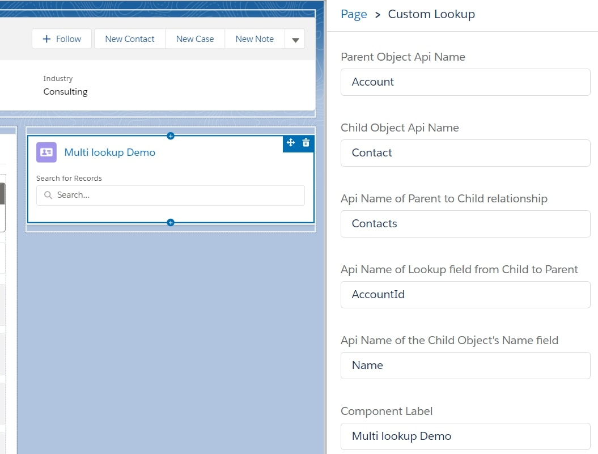
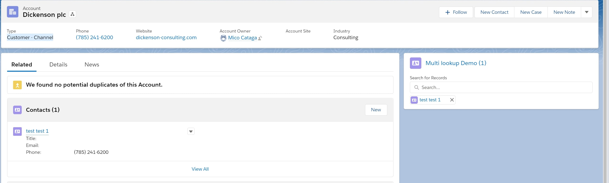
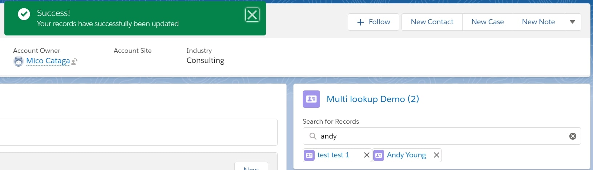

## customMultiLookup created by Mico Cataga
An LWC custom lookup that allows users to reparent child object records while on the parent object
## Screenshots

LWC Component Attributes

Childen records listed under component, compared the related list

An existing record reparented using the component

